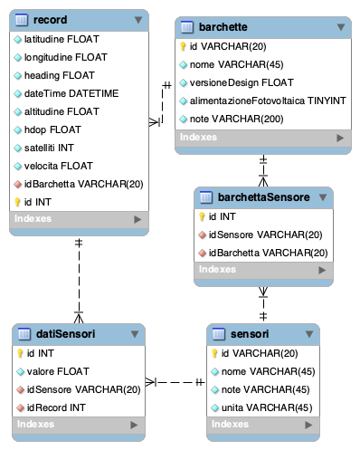

# Database barchette
Alberto Nidasio - Stefano Vassallo

[PDF presentazione 😄](Presentazione_database_barchette.pdf)

## Problema da risolvere
Il team Specchi d’Acqua, che parteciperà alle prossime olimpiadi di robotica a Genova, ha bisogno di salvare i dati ambientali raccolti dalle proprie barchette (temperatura, umidità, ecc...).

## Casi d'uso


## Struttura della soluzione
- Database
- Server REST
- Sito web

## Schema database



## Codice server
Utilizzo di NodeJs per l'applicazione server che, oltre alle API REST mette a disposizione il sito web

[Esempio codice server](Server/server.ts)
```typescript
//preparo express
const app = express()
app.use(express.json())
app.use(cors({origin: '*'}))

//rendo disponibile la pagina web nella root dell'url
app.use('/', express.static('website'))

//SEZIONE RECORD

//lista record con i dati dei sensori
app.get('/api/record', async (req, res) => {
    console.log(req.method, req.url, req.query, req.body)

    try {
        return res.send(await database.ottieniRecord(req.query.limite))
    } catch(errore) {
        return res.status(500).send(errore.message)
    }
})
```

## Codice client
Pagina web realizzata con Boostrap e JQuery

[Esempio metodo GET](Server/website/code.js)
```javascript
//funzione per caricare le barchette nella tabella
function caricaBarchette() {
    const http = new XMLHttpRequest()
    const url = 'http://localhost/api/barchette'
    http.open('GET', url)
    http.onload = (e) => {
        var data = JSON.parse(http.responseText)
        $('#tabella-barchette').bootstrapTable({
            columns: [{
                    field:'id',
                    title: '#'
                }, {
                    field:'nome',
                    title: 'Nome'
                }, {
                    field:'versioneDesign',
                    title: 'V. Design'
                }, {
                    field:'alimentazioneFotovoltaica',
                    title: 'Fotovoltaico'
                }, {
                    field:'note',
                    title: 'Note'
                }],
            data
        })
    }
    http.send()
}
```
[Esempio metodo POST](Server/website/code.js)
```javascript
//funzione per registrare un nuovo sensore
function aggiungiSensore() {
    let id = document.getElementById('sensore-id').value
    let nome = document.getElementById('sensore-nome').value
    let note = document.getElementById('sensore-nota').value
    let unita = document.getElementById('sensore-unita').value

    //controllo i dati
    if(id == '' || nome == '' || note == '' || unita == '') {
        //mostro un avviso all'utente
        alert('Compilare tutti i campi!')
    } else{
        const http = new XMLHttpRequest()
        const url = 'http://localhost/api/sensori'
        http.open('POST', url)
        http.setRequestHeader('Content-Type', 'application/json')

        var sensore = { id, nome, note, unita }

        http.onload = (e) => {
            document.getElementById('sensore-id').value = ''
            document.getElementById('sensore-nome').value = ''
            document.getElementById('sensore-nota').value = ''
            document.getElementById('sensore-unita').value = ''
        }

        http.send(JSON.stringify(sensore))
    }	
}
```