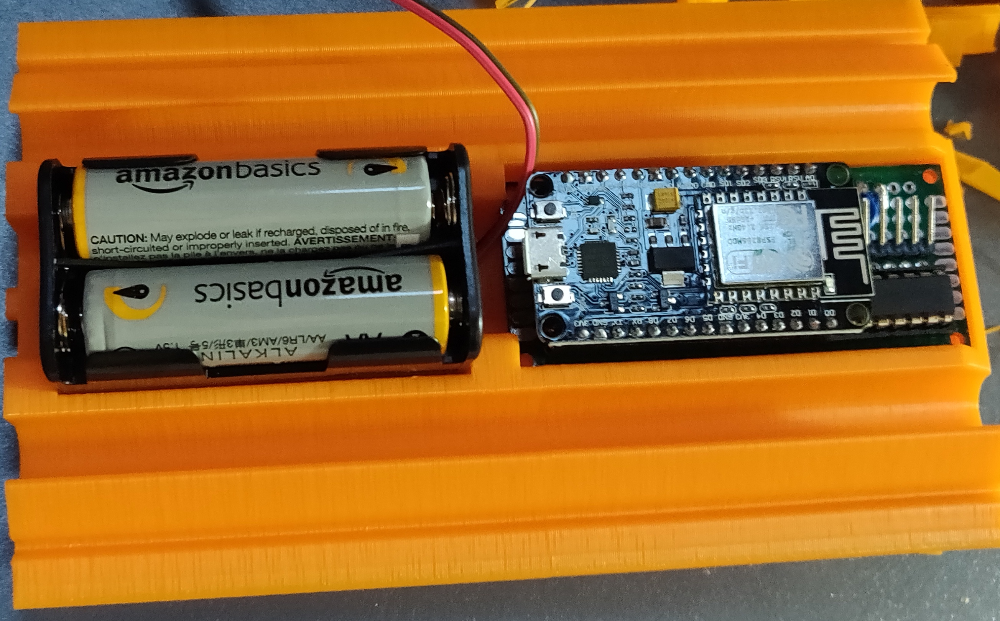

# Specchi d'Acqua

[Manifesto team Specchi d'Acqua](Manifesto_team_Specchi_d'Acqua.pdf)

## Presentazione del progetto

### Introduzione
Il progetto Specchi d’Acqua si pone l’obiettivo di aiutare gli scienziati nello
studio dei cambiamenti climatici. Proponiamo una rete di droni autonomi
che, spostandosi per i mari, monitorano i cambiamenti dovuti al riscaldamento
globale: dall’aumento delle temperature all'innalzamento del livello dell’acqua.
I droni sono in parte costruiti con elementi riciclati per diminuire il loro
impatto ambientale, nell’ottica del riutilizzo di materiali destinati al monouso.

**Video:** [prove dei robot](https://youtu.be/X26Ot0CG_ao)

### La squadra

**Video**: [presentazione team](https://youtu.be/9cNglWY3D-Q)

Alberto Nidasio e Matteo Cristini

### Il problema affrontato

**Video**: [Il cambiamento climatico è reale!](https://youtu.be/WMdsdqbVi9s)

Il cambiamento climatico è un grave problema che affligge il nostro pianeta e produce effetti devastanti, molte volte purtroppo imprevedibili, che già oggi possiamo constatare. Il mar Mediterraneo, ad esempio, essendo una zona chiusa sta sperimentando l’impatto di questi cambiamenti più di altre aree del pianeta.
Gli effetti prodotti sono svariati e l’aumento delle temperature (il 2018 è il quarto anno più caldo di sempre) ne è la causa principale. Tra i numerosi problemi c’è la riduzione delle precipitazioni, seppur controintuitiva, che comporta l’aumento della richiesta idrica, soprattutto per uso agricolo (si stima fino al 74%). Aumentano inoltre la diffusione delle malattie e i danni alla salute dovuti alle ondate di calore che ormai caratterizzano le nostre estati.
Il livello dei mari in tutto il mondo sta aumentando e le località costiere corrono un grande rischio. Invece le alte temperature danneggiano i coralli e alterano i delicati ecosistemi marini.
Lo studio da parte degli scienziati di tutti questi fenomeni interconnessi e altamente complessi si basa sulla disponibilità di dati e analisi il più possibile accurati e distribuiti al fine di poter, non solo capire il perché si sia verificato un fenomeno, ma anche per prevedere possibili disastri.

### La nostra soluzione

**Video**: [Presentazione del progetto](https://youtu.be/HUvQelgl1Qg)

La raccolta dati è fondamentale prima di ogni azione mirata: la si fa per un’analisi di mercato, per l’acquisto di un giocatore, perfino per un attacco informatico. Impiegarla per studiare i fenomeni naturali è però più complesso e costoso, infatti richiede attrezzature all’avanguardia non sempre recuperabili.
Noi abbiamo la soluzione! Il nostro progetto consiste in una flotta di droni acquatici, realizzati con materiali riciclati, in grado di distribuirsi in autonomia in un’area prestabilita, tornando alla base a fine missione. Grazie a un modulo GPS installato su ciascuno di essi, i robot potranno capire dove si trovano e mantenere la posizione nonostante le correnti. I droni potranno essere equipaggiati con diversi sensori per monitorare qualunque tipo di dato sia richiesto dagli analisti e, attraverso un sistema di comunicazione wireless, saranno in grado di trasmettere i dati in tempo reale alla base, associandoli con la posizione recuperata dal GPS.I prototipi che abbiamo preprato hanno molti aspetti innovativi. La costruzione dello scafo utilizza bottigliette di plastica e questo ci permette di recuperare quello che altrimenti sarebbe un rifiuto abbandonato.
Inoltre sia il codice che i design del robot saranno open-source permettendo così a chiunque di migliorare il progetto apportando nuove modifiche.
Il robot utilizza anche parti stampate in 3D. Questi componenti sono realizzati su misura, permettendo a ogni modello di essere equipaggiato con diversi sensori e batterie, per adattarsi alle esigenze del momento.

## Descrizione tecnica

### Lo scafo

Il drone è composto da uno scafo realizzato con bottigliette di plastica tenuto assieme da una struttura progettata a **CAD** e realizzata con **stampante 3D**, adattabile in base alle esigenze e che contiene:
- i motori, per la propulsione e l'orientamento dell'elica;
- i sensori;
- il microcontrollore, che raccoglie i dati, gestisce la comunicazione e coordina il movimento;
- la sezione alimentazione che fornisce elettricità ai vari componenti.

I modelli del drone sono disponibili [qui](Modelli).

**Video:** [Esplosione modello](specchidacqua.xyz)

### Processore, sensori, alimentazione e schemi tecnici

La raccolta dei dati è gestita dal microcontrollore ESP8266 che è stato scelto per la sua disponibilità a un prezzo modesto e per le numerose funzionalità offerte. Infatti, non solo dispone di numerose porte I/O, ma anche di un trasmettitore wifi che metterà in comunicazione i droni tra di loro. Per quanto riguarda la scelta dei sensori, il progetto prevede piena libertà nella loro selezione in base alle esigenze del caso. Per questo prototipo abbiamo impiegato sensori di temperatura (sia in aria che in acqua, con una sonda da immergere), umidità e un modulo gps. Verrà quindi registrata la posizione del robot non solo per permettergli di distribuirsi nell’area designata, ma anche per associarla ai dati dei sensori.
Per l’elettronica di bordo sono stati previsti diversi metodi di alimentazione:
- tramite pile stilo da sostituire regolarmente (metodo attuale);
- tramite batteria ricaricabile al litio: è previsto siano necessarie due celle
assieme a un circuito di ricarica dedicato; Sul coperchio è possibile installare un pannello solare di dimensioni contenute in grado di ricaricare il gruppo batterie del robot.

#### Processore e sensori

L'Esp8266 ci permette di utilizzare i sensori **DHT11** (temperatura e umidità aria), **DS18B20** (Sonda temperatura acqua) e il modulo gps **GT-U7**. Per collegare tutti questi componenti abbiamo preparato una scheda millefori che verrà alloggiata nel coperchio dello scafo per una manutenzione facile e semplice. Una volta finalizzato il design potremo creare un vera e propria **PCB** con componenti **SMT**.

#### Alimentazione

Per alimentare la scheda e i motori abbiamo utilizzato due set di batterie separati. Il primo, composto da 4 batteria AA fornisce elettricità al motore DC che muove l'elica, e il secondo, formato da 6 batterie AAA, che alimenta l'elettronica e il motore passo passo che inclina l'elica.
Questo evita che, nel caso di cali di tensione all'elettronica dovuti all'avvio del motore o se si scaricano le batterie del motore DC, il drone perda il segnale e non risponda più ai programmi.

#### Schemi tecnici

## Descrizione tecnica: collettore

I droni, distribuite su una vasta zona, avranno bisogno di un sistema di comunicazione affidabile a lunga distanza. In base alle dimensioni dell’area su cui devono essere distribuiti abbiamo valutato diverse soluzioni:
- Per comunicazioni nell’ordine delle decine di chilometri sono disponibili moduli **LoRa** (Long Range), anche ad un prezzo ridotto, che permettono un collegamento a maglia, estendendo così considerevolmente la rete, a patto che ci sia un numero sufficiente di nodi.
- Nel caso invece si voglia lavorare su zone più ampie, esigendo anche un livello di affidabilità superiore, si potrà sfruttare, nei prossimi anni, la rete satellitare **​Starlink**,​ una costellazione di 12.000 satelliti che SpaceX sta sviluppando per portare l’accesso ad internet in qualunque area del pianeta. Questo offrirebbe una connessione indipendente per ciascun drone eliminando la possibilità che alcuni possano rimanere isolati.

Per il prototipo abbiamo utilizzato una rete **Wifi** che collega droni e collettore con la possibilità di essere estesa con dei ripetitori. Lo stesso sistema che abbiamo sviluppato, che utilizza il protocollo **MQTT** (per l'invio dei dati)  e **TCP** (per il controllo da remoto), potrà essere implementata anche con la rete cellurare.

Per il collettore, ovvero il server a terra che memorizza i dati, abbiamo utilizzato un **Raspberry pi**.

## Software

Il collettore, che basandosi su linux è possibile sostituire facilemte, implementa un broker **Mosquitto**, un server **Sql**, un server **HTTP** con un sito web e un processo per sincronizzare i dati web che forniscono i servizi necessari per la comunicazione, il salvataggio e la visualizzazione dei dati.

### Broker Mosquitto

Per la comunicazione tra droni e collettore abbiamo utilizzato il protocollo ***MQTT*** che ci permette un'affidabilità della comunizatione superiore (QOS 2) e riduzione della dimensione dei messaggi. Questo è fornito dal popolare broker **Mosquitto** a cui si collegheranno i droni come publisher e il server.

### Server SQL

Il server **SQL** (MariaDB) è organizzato in 4 tabelle principali:
- **Droni**: contiene la lista di tutte i droni prodotti;
- **Sensori**: la lista di tutti i sensori utlizzati (esclusi GPS e bussola);
- **Record**: dove vengono salvati i dati principali di un record come posizione, data, ora e id del drone;
- **Dati sensori**: permette di memorizzare i valori di ciascun sensore rilevati in un record (questa è una tabella separata perchè i droni potrebbero non avere tutti la stessa configurazione).

### Server HTTP

Questo servizio fornisce delle **API REST** che il sito web, sempre messo a disposizione da questo server, utilizza per mostrare i dati.

## Olimpiadi

### Giorno 1
**Video:** [time-lapse giorno 1](https://youtu.be/L8EZxuS9RvE), [time-lapse giorno 2](https://youtu.be/6cRvtolq8c4)

